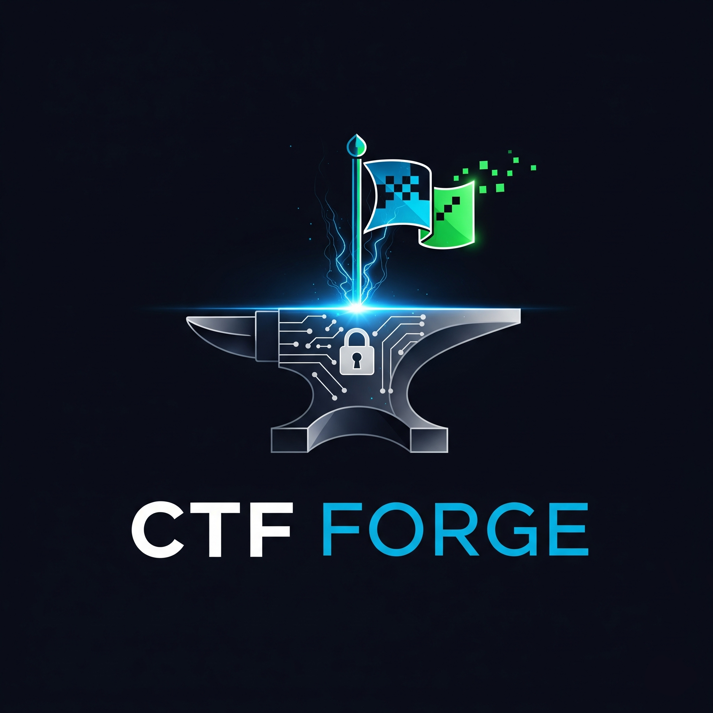

# CTF Forge

---

### プロジェクト概要

**CTF Forge**は、ユーザーが自由にCTF（Capture The Flag）の問題を作成・管理・公開できるプラットフォームです。
このプラットフォームを通じて、誰もがセキュリティの知識を楽しく学び、共有することで、より広範なセキュリティ文化の普及を目指します。

### 特徴

* **問題作成・管理**: 強力な管理ツールにより、CTFの問題を簡単に作成・編集・公開できます。
* **ユーザー認証**: 安全な認証システムを通じて、ユーザーは自分のアカウントを管理できます。
* **APIファースト**: バックエンドはRESTful APIとして構築されており、柔軟なフロントエンドとの連携が可能です。
* **PostgreSQL**: データの永続化に信頼性の高いPostgreSQLを採用しています。

### 使用技術

#### バックエンド
* **Go**: プログラミング言語
* **Gin**: Webフレームワーク
* **GORM**: ORM (Object-Relational Mapping)
* **PostgreSQL**: データベース

#### フロントエンド
* **React**: UIライブラリ
* **Vite**: ビルドツール

### APIドキュメント

APIの詳細は、アプリケーション起動後にSwagger UIで確認できます。

* **ドキュメントURL**: `http://localhost:8080/swagger/index.html`

### 貢献

バグ報告や機能提案など、コントリビュートを歓迎します。

### ライセンス

このプロジェクトは[LICENSE](LICENSE)ファイルに記載されているライセンスの下で公開されています。
